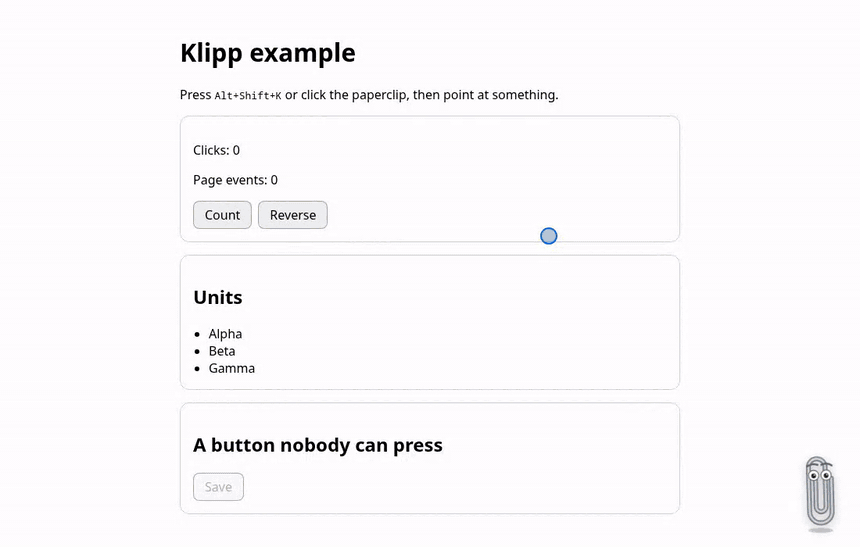
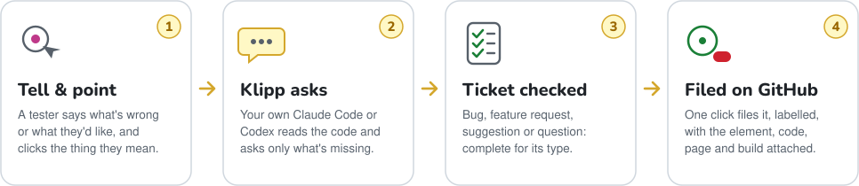

<p align="center">
  <picture>
    <source media="(prefers-color-scheme: dark)" srcset=".github/assets/klipp-logo-dark.svg">
    
  </picture>
</p>

<h3 align="center">The paperclip that turns “this looks wrong” into a ticket your team can act on.</h3>

<p align="center">
  <a href="https://github.com/perara/klipp/actions/workflows/ci.yml"></a>
  <a href="https://github.com/perara/klipp/releases"></a>
  <a href="LICENSE"></a>
  
  
  
  
</p>

<p align="center">
  <a href="#quick-start"><b>Quick start</b></a> ·
  <a href="#how-it-works"><b>How it works</b></a> ·
  <a href="#tickets"><b>Tickets</b></a> ·
  <a href="#privacy-and-safety"><b>Privacy</b></a> ·
  <a href="#options"><b>Options</b></a>
</p>

<p align="center">
  
</p>
<p align="center"><sub>Recorded from the example app with <code>npm run demo:record</code>. The agent is scripted for a steady pace; its lines come from a real Codex session.</sub></p>

---

Klipp lives in the corner of your web app while you build and test it. A tester clicks the
paperclip, says what's wrong or what they'd like, and points at the thing they mean. Klipp works
out whether it's a **bug**, a **feature request**, a **suggestion** or a **question**, asks only
for what that kind of ticket still needs, finds where it lives in the code, and files it on
GitHub when they say so.

Its brain is a coding agent you already have, **Claude Code** or **Codex**, run in the background
by your dev server with your own login. There are no API keys and nothing to host.

<table>
  <tr>
    <td width="33%" valign="top">
      <h4>🎯 Point, don't describe</h4>
      Testers click the element instead of describing it. Every element carries a stable ID
      derived from the source, so the ticket names the exact file, line and component, even in
      a list or a shared component.
    </td>
    <td width="33%" valign="top">
      <h4>🧭 Triage built in</h4>
      Each ticket type has what it needs: steps and severity for a bug, the need behind a feature
      request. An incomplete ticket goes back to the agent, which asks for what's missing, one
      question at a time.
    </td>
    <td width="33%" valign="top">
      <h4>🔒 Yours, and read-only</h4>
      The agent runs on your machine with your login and can't change a file. It never sees the
      text on the page, and nothing is filed until someone clicks <b>File ticket</b>.
    </td>
  </tr>
</table>

## Quick start

**Requirements:** Node.js 22+, Vite 5.4.12+ to 8, and for the chat, `claude` or `codex` on macOS or
Linux (on Windows, run the dev server in WSL). Element IDs tell instances apart through React;
other JSX frameworks get the code location, without the call-site detail.

Klipp installs from its GitHub release. npm 12 and later fetch a dependency from a URL only
when the project allows it, so allow it for your project's own dependencies first:

```bash
npm config set allow-remote root --location=project
npm install -D https://github.com/perara/klipp/releases/download/v0.8.0/klipp-0.8.0.tgz
```

The first line writes `allow-remote=root` to the project's `.npmrc`; commit it with the lockfile,
which pins the tarball's checksum. Older npm versions need only the second line.

```ts
// vite.config.ts
import react from '@vitejs/plugin-react';
import klipp from 'klipp/vite';
import { defineConfig } from 'vite';

export default defineConfig({
  plugins: [react(), klipp()],
});
```

Then:

1. Have [Claude Code](https://code.claude.com) (`claude`) or [Codex](https://github.com/openai/codex) (`codex`) installed and logged in on the same machine.
2. Log in to the GitHub CLI (`gh auth login`), or set `GITHUB_TOKEN`, so Klipp can file tickets.
3. Run your dev server, open the app at `localhost`, and click the paperclip, or press <kbd>Alt</kbd>+<kbd>Shift</kbd>+<kbd>K</kbd>.

To let testers in from other devices, such as a phone on your network, set `chat.allowRemote`.
The dev server then prints a pairing link; each device opens it once.

Klipp runs **under the dev server and is off in builds**. Turn it on for a test build with
`KLIPP=1 vite build` (the chat then works under `vite preview`), and off anywhere with `KLIPP=0`.
It's always off under Vitest.

## How it works

<p align="center">
  <picture>
    <source media="(prefers-color-scheme: dark)" srcset=".github/assets/klipp-flow-dark.svg">
    
  </picture>
</p>

The dev server runs the agent once per message and resumes its session, so the conversation
carries on. The agent reaches the page only through Klipp's three tools, served to it over MCP on
a loopback port, behind a token that lives as long as the dev server:

| Tool               | What it does                                                                             |
| ------------------ | ---------------------------------------------------------------------------------------- |
| `point_at_element` | Asks the tester to click something; returns its ID, code location, components and state. |
| `inspect_element`  | Looks up an element by its ID, such as something underneath the one the tester clicked.  |
| `propose_ticket`   | Shows the ticket for the tester to file, once it has everything its type needs.          |

## Tickets

| Type               | When                                          | Klipp collects                                        | Labels                 |
| ------------------ | --------------------------------------------- | ----------------------------------------------------- | ---------------------- |
| 🐞 Bug             | Something doesn't work as intended            | what happens, what should, steps, how often, severity | `bug`, `klipp`         |
| ✨ Feature request | Something the app can't do yet that is needed | the need, what would help, who it helps, today's way  | `enhancement`, `klipp` |
| 💡 Suggestion      | Something works but could be better           | what's there now, the change, why it's better         | `suggestion`, `klipp`  |
| ❓ Question        | How something is meant to work                | the question, and the answer from the code            | `question`, `klipp`    |

Every ticket also gets the element's Klipp ID, a permalink to its code at the build's commit, the
components it sits in, its state (disabled, hidden, covered), the page, the build and the
browser, so nobody has to ask "where?" or "which version?". The card shows all of it before
anyone files. Change the labels with `chat.labels`.

Klipp files on github.com, or on GitHub Enterprise when `gh` is logged in to that host
(`gh auth login --hostname`). A token is only ever sent to the host it belongs to.

### Stable element IDs

At build time every element in your JSX gets a `data-klipp` attribute, holding a hash of where it
is written. Nobody writes IDs by hand. The full ID is the same for every user and every reload,
and it leads back to a file and line:

```
3f9a2c1d.x7k2:2/1/s/0@search-areas%3A7
└ sid ──┘ └inst┘ │ └──┬──┘ └ something drawn on a canvas, such as a map feature
                 │    └ path into markup the build didn't stamp (third-party DOM),
                 │      where s steps into a web component's shadow root
                 └ which one, when identical instances repeat
```

The instance part comes from the component call sites and React keys above the element. So a
shared `<Button>` used in two places gets two IDs, and a list row keeps its ID when the list
reorders. Open `https://your.app/page?klipp=3f9a2c1d.x7k2` and Klipp opens on that element. In
the DevTools console, `klipp.id($0)` gives an element's ID and `klipp.find(id)` finds it.

Web components work too: Klipp points into open shadow roots, and an ID steps into one with `s`.

### Maps, 3D and other canvases

A canvas has no elements inside it, so on its own, pointing at a map or a 3D scene stops at the
canvas. Tell Klipp what the canvas draws, and testers point at the feature or the object itself:
the chat, the agent and the ticket name it, and a link brings it back.

```ts
import { maplibreTargets, registerCanvas, threeTargets } from 'klipp/canvas';

// A MapLibre GL map: the topmost rendered feature, by its layer and id.
registerCanvas(map.getCanvas(), maplibreTargets(map, { layers: ['incidents'], reveal: ['kind'] }));

// A three.js scene: the nearest visible object, by its name down the scene graph.
registerCanvas(renderer.domElement, threeTargets({ scene, camera, raycaster: new Raycaster() }));
```

A canvas can carry several, like the layers it draws; the one registered last is asked first.
A three.js layer drawn inside a MapLibre map registers on the map's canvas after the map, and
its hand-set camera works as it is.

With react-three-fiber, register inside `<Canvas>`. Klipp's build also stamps each `<mesh>`,
`<group>` and the like with where it is written, so pointing at a 3D object leads to its JSX:

```tsx
function KlippTargets() {
  const { gl, scene, camera, raycaster } = useThree();
  useEffect(
    () => registerCanvas(gl.domElement, threeTargets({ scene, camera, raycaster })),
    [gl, scene, camera, raycaster],
  );
  return null;
}
```

Anything else that draws (a chart, a game, another map library) takes an adapter of your own:
`at(point, canvas)` returns what is drawn at a point, as `{ key, label, details, box }`, and
`find(key, canvas)` finds it again for a link. Map features are described by their layer,
source, geometry and id; property values stay out unless you name them in `reveal`.
Registering does nothing where Klipp isn't running. To keep it out of production bundles
entirely, register from a dynamic import behind `if (import.meta.env.DEV)`.

## Privacy and safety

- **No page text.** The agent sees structure and state, never the text on the page or form values. Console errors are sent by name and message; objects logged with them are named, not opened. Map features and 3D objects are described by their layer, geometry, type and name; their properties' values only when the app names them in `reveal`. Query values in addresses are blanked, except the ones you list in `keepQuery`.
- **Read-only agents, kept to your repository.** Claude runs `--restricted` with only Read, Grep and Glob: no shell, no web, and `.env`, key and credential files are denied. Codex runs in a sandbox that reads only the repository and the system files programs need, and writes nothing; its commands get only a core environment. Neither loads your own settings or other MCP servers, and neither gets the dev server's environment beyond what it needs to start and log in.
- **Your browser only.** The chat answers a browser on this machine at `localhost`, from the page itself. Other names, tunnels and proxies are turned away, even from loopback, so a site that rebinds its name to `127.0.0.1` gets nothing. With `chat.allowRemote`, other devices pair once with the code the dev server prints.
- **Nothing filed without a click.** The card shows the whole ticket first, and the server files only the ticket the agent proposed, once.
- **Out of your page's way.** Klipp's key, pointer and focus events stop at its own root, so your page's handlers don't see them (only listeners on `window` or `document` in the capture phase, which see everything, still do).
- **Strict-CSP friendly.** Klipp uses no `innerHTML`, no inline styles and no inline scripts.

[SECURITY.md](SECURITY.md) has the details, and what Klipp does not protect against.

## On a shared server

Under the dev server, Klipp's chat answers only the developer's own browser. For a shared test
environment, where testers sign in through a proxy, run the chat as its own server and route the
app's `/@klipp/` to it:

```bash
KLIPP=1 vite build   # the app, with Klipp's IDs and runtime
KLIPP_ROOT=/srv/app KLIPP_HOST=0.0.0.0 KLIPP_IDENTITY_HEADER=x-klipp-user KLIPP_AGENT=claude \
  KLIPP_GITHUB_TOKEN=github_pat_… npx klipp serve
```

- **Who:** the proxy names the signed-in user in a header it sets itself (and removes from what
  browsers send); `KLIPP_IDENTITY_HEADER` says which. Requests without it are refused.
  `KLIPP_ALLOW` limits the chat to a comma-separated list of users; the default, `*`, is anyone
  signed in. Each user's conversations are theirs alone, they may send `KLIPP_MESSAGES_PER_HOUR`
  messages an hour (default 30), and their tickets say who reported them.
- **What the agent reads:** `KLIPP_ROOT`, the source at the deployed commit. Bake it into the
  server's image, so it always matches what testers see. Anyone who can chat can ask about
  any of it.
- **Which agent:** Claude needs no operating-system sandbox: `--restricted` with only Read, Grep
  and Glob keeps it to `KLIPP_ROOT`, so it runs in an ordinary locked-down container. Codex
  runs shell commands, and its sandbox (bubblewrap) needs the container to allow unprivileged
  user namespaces: a looser seccomp profile, and on hosts that restrict user namespaces through
  AppArmor (Ubuntu 24.04 and later), a looser AppArmor profile too. Prefer Claude there.
- **Running it:** `klipp serve` refuses to listen beyond localhost without
  `KLIPP_IDENTITY_HEADER`, answers `GET /healthz` for health checks, stops every run on
  `SIGTERM`, and logs one JSON line per turn and per filed ticket: who, which agent, how long,
  never what anyone typed. `klipp serve --help` lists its settings; `klipp/server` has the same
  as `serve()` and `createKlippMiddleware()`.

## The AI box

The agents as a service. `klipp box` is one place for the Claude Code and Codex logins, a web page
to sign them in, tokens for the apps that use them, and the runs to watch, live or afterwards.
Apps ask it for answers over HTTP, so an app's own server needs no CLIs and no logins.

```bash
KLIPP_ROOT=~/code/app npx klipp box   # then open http://127.0.0.1:8790/
```

On its page, sign Claude and Codex in with their own CLIs (a link, then a pasted code or a device
code), check that each is ready, make a token for each app, and read its runs. Settings:
`KLIPP_ROOT` (the repository the agents read, read-only; default the working directory),
`KLIPP_BOX_HOST` (`127.0.0.1`) and `KLIPP_BOX_PORT` (`8790`), `KLIPP_BOX_DATA` (logins, tokens and
run logs; `~/.klipp-box`), `KLIPP_BOX_TOKENS` (`name=token,…`, besides the ones made on the
page), `KLIPP_MAX_RUNS` (`2`) and `KLIPP_MODEL`. `klipp box --help` lists them.

**Pointing an app at it.** In the Vite plugin, `chat: { box: { url: 'http://127.0.0.1:8790' } }`,
with `KLIPP_BOX_TOKEN` in `.env`; `KLIPP_BOX_URL` can name the address instead of the config. For
`klipp serve`, set `KLIPP_BOX_URL` and `KLIPP_BOX_TOKEN`. With a box, the agents run there, not
on the app's machine; the page's tools still run in the user's browser.

**In a container:**

- Set `KLIPP_BOX_HOST=0.0.0.0` so the published port reaches the box, and keep that port on
  loopback: publish it only on the host's `127.0.0.1`, or put the box on a Docker network shared
  only with the apps that call it. The page has no sign-in and shares its port with `/v1`, so
  whoever can reach the port can use the page.
- Put `/data` (`KLIPP_BOX_DATA`) on a volume, and mount the source read-only.
- Codex needs the same seccomp and AppArmor changes as under
  [On a shared server](#on-a-shared-server).
- The page answers only to localhost names, so reach it through
  `ssh -L 8790:<box>:8790 <host>` and open `http://127.0.0.1:8790/`.

**What it keeps and refuses:**

- **The page answers only to localhost names, and only to its own page.** The page and its
  `/ui/api/` answer requests for `localhost`, `127.0.0.1` or `[::1]` and refuse any other name
  with 403. Changes (signing in, tokens) also need the header the page itself sends, which another
  website can't add. That stops other websites and DNS rebinding.
- **The page has no sign-in.** It checks the name a request asks for, not who connected: anyone
  who can reach the port can ask for `localhost` and make tokens or sign the agents out. Keep the
  port on loopback, or on a Docker network shared only with the apps that call the box. An app's
  token guards `/v1`, not the page.
- **Subscriptions only.** `ANTHROPIC_API_KEY`, `ANTHROPIC_AUTH_TOKEN`, `OPENAI_API_KEY` and
  `CODEX_API_KEY` are removed from what the agents get, so no run bills an API account.
- **Tokens are stored hashed.** A new token is shown once; only its SHA-256 is kept.
- **Run logs are private.** The data folder is mode 0700. The box's own files (the tokens and
  each run's log) are 0600; the CLIs' login files in `claude/` and `codex/` keep the modes the
  CLIs give them, inside those 0700 folders. A run is one file with the app's name, the message,
  every event and each tool call with its answer; the newest 200 are kept.
- **Read-only agents,** as everywhere else in Klipp. A caller can't change the repository, the
  sandbox or the environment.

**Protocol v1.** Every request carries `Authorization: Bearer <token>`; a missing or unknown token
gets 401.

| Endpoint                         | What it does                                                                              |
| -------------------------------- | ----------------------------------------------------------------------------------------- |
| `GET /v1/agents`                 | Per agent: `available`, with a `problem` (not signed in is one), and the `preferred` one. |
| `POST /v1/runs`                  | Starts a run and streams it as NDJSON; body below.                                        |
| `POST /v1/runs/:run/tools/:call` | Answers a tool call with `{ "content": "…", "isError"?: true }`; 204.                     |

A run is `{ agent, system, message, session?, model?, tools }`. `tools` are the page tools the app
answers: up to 16, each `{ name, description, inputSchema }` with a name like `point_at_element`.
`system` is at most 64 KiB and `message` 256 KiB. Before the stream starts: 400 for a bad request,
409 when the agent isn't ready, 429 when `KLIPP_MAX_RUNS` runs are going. Otherwise 200 and one JSON
object per line:

- `{"type":"run","id":"<run>"}` first.
- `{"type":"session","id":"<session>"}`: the agent's session, to send as `session` next time.
- `{"type":"text","delta":"…"}` for the answer as it comes, and `{"type":"break"}` where one
  paragraph of it ends and another begins.
- `{"type":"activity","label":"…"}` for what the agent is doing, such as reading a file.
- `{"type":"tool_call","id":"<call>","name":"…","input":{…}}` when the agent calls one of the run's
  tools. The app answers it at `/v1/runs/:run/tools/:call` with `{ "content": "…" }` (and
  `"isError": true` for a failure) within 30 minutes.
- `{"type":"error","message":"…"}` when the run fails, and `{"type":"done"}` when it ends well.
- An empty line every 15 seconds, to keep the stream alive.

The stream ends after `done` or `error`, and the CLI then has 10 seconds to exit by itself. If the
caller closes the stream before its end, the run is stopped and any pending tool call is answered
"The turn ended." A `session` continues only for the app (the token's name) that started it; for
any other app, the run starts a new session.

**One person's box.** It signs in with your own Claude and ChatGPT subscriptions. Anthropic's terms
don't allow routing other people's requests through a subscription, so give the box only to apps
that you alone use, or use API keys with the apps other people use.

## Options

| Option                    | Default                           | What it does                                                           |
| ------------------------- | --------------------------------- | ---------------------------------------------------------------------- |
| `enabled`                 | dev only                          | Force Klipp on or off.                                                 |
| `chat.agent`              | `claude`                          | Who answers first; the chat can switch to the other.                   |
| `chat.model`              | the agent's default               | Passed to the agent.                                                   |
| `chat.labels`             | see [Tickets](#tickets)           | GitHub labels per ticket type.                                         |
| `chat.allowRemote`        | `false`                           | Let other devices and addresses in, each paired once.                  |
| `chat.pairingCode`        | random per start                  | A fixed pairing code (10+ characters), for a shared test environment.  |
| `chat.passEnv`            | `[]`                              | More environment variables to pass to the agent, by name.              |
| `chat.maxRuns`            | `4`                               | Agent runs at once, across all conversations.                          |
| `chat.box`                | none                              | Run the agents in an [AI box](#the-ai-box): `{ url, token? }`.         |
| `chat`                    | `{}`                              | `false` turns the chat off and keeps pointing and links.               |
| `launcher`                | `bottom-right`                    | Corner for the paperclip, or `false` for the hotkey only.              |
| `offset`                  | `{ x: 0, y: 0 }`                  | Pixels in from the corner, to clear things the app keeps there.        |
| `hotkey`                  | `alt+shift+k`                     | Opens and closes the chat.                                             |
| `keepQuery`               | `[]`                              | Query parameters (such as `demo`) kept in addresses and links.         |
| `repo` / `commit`         | from `git`                        | Where permalinks and tickets go.                                       |
| `include` / `exclude`     | `.jsx`/`.tsx`, not `node_modules` | Which files to stamp.                                                  |
| `stampComponents`         | `true`                            | Mark component call sites, so shared components tell their uses apart. |
| `launcherUnderAutomation` | `false`                           | Show the paperclip under Playwright and WebDriver too.                 |

## Meet Klipp

<p align="center">
  
</p>

His eyes follow your pointer. He hops when he says hello, sways while he thinks, bounces as he
talks, leans in while you point, and droops when something goes wrong.

## Limits

- A canvas the app hasn't registered is pointed at as a whole: Klipp can't see what it draws.
- Closed shadow roots can't be reached by any script on the page, Klipp's included.
- Permalinks and tickets use GitHub.
- Codex can read every file in the repository, `.env` files included; Claude is denied those. Keep secrets out of the working tree, or use Claude.

## Development

```bash
npm run check        # format, build, lint, typecheck, unit tests and package exports (CI `check`)
npm run test:e2e     # the example app under the dev server, a production build, touch, a paired device, and the AI box
npm run test:compat  # the packed package against Vite 5, 6, 7 and 8
npm run demo:record  # re-record the demo GIF above (needs ffmpeg)
```

The tests use a stand-in agent that speaks both CLIs' formats and MCP, so they need no login. See
[CONTRIBUTING.md](CONTRIBUTING.md) to get started, and [SECURITY.md](SECURITY.md) for how Klipp
keeps the agent contained and how to report a problem.

## License

[MIT](LICENSE) © 2026 Per-Arne Andersen

<p align="center"><sub>Made with 📎 for the people who find the bugs.</sub></p>
